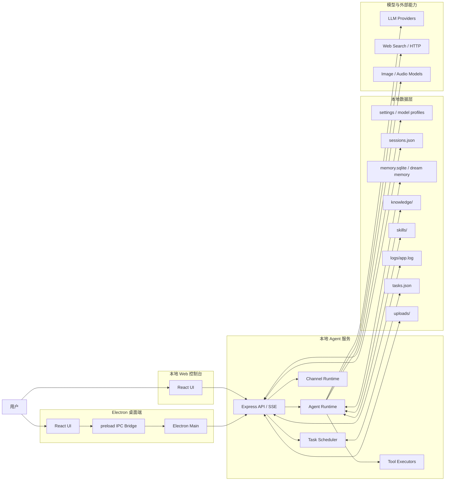

# Nexo Agent

[English](./README.en.md)

Nexo Agent 是一个本地优先的 AI Agent 桌面应用与 Web 控制台。它把对话、多模型编排、工具调用、持久记忆、本地知识库、技能系统、定时任务和渠道接入放在同一个工作台里，适合个人助理、研发协作和团队内部 Agent 场景。

项目基于 Electron、React、TypeScript、Express 与 LangChain 构建。桌面端启动时会同时拉起本地后端和本地 Web 控制台，Web 端与 Electron 共用同一套会话、配置和 Agent 运行时。

## 核心能力

- 多会话聊天：支持创建、切换、重命名、删除和持久化历史会话
- 多模型配置：支持 OpenAI Compatible / Anthropic Compatible 等模型配置与主模型切换
- Agent 工具调用：支持 `web_search`、`http_request`、`shell_command`、`file_read`、`file_write`、多模态工具等
- 记忆系统：支持 `daily`、`dream`、`script` 三类跨会话持久记忆，使用 SQLite + embedding 检索
- 知识库：支持本地 Markdown 文件管理、检索与聊天上下文注入
- 技能系统：支持内置技能、工作区技能、托管技能、市场技能
- 定时任务：支持 Cron 任务、手动触发和任务会话沉淀
- 渠道接入：支持 Web、飞书、钉钉、企业微信、微信公众号等渠道配置
- 双端运行：Electron 桌面端与本地 Web 控制台共用后端

## 快速开始

### 环境要求

- Node.js 22 或兼容版本
- npm
- 可用的模型服务 API Key

### 安装依赖

```bash
npm install
```

### 启动桌面开发环境

```bash
npm run dev:electron
```

会同时启动：

- Vite 前端开发服务：`http://localhost:8106`
- Electron 主进程编译监听
- Electron 桌面窗口
- 本地 Express Web 控制台：`http://localhost:9898`

### 只启动 Web 前端

```bash
npm run dev:web
```

说明：

- Vite 会监听 `http://localhost:8106`
- `/api` 与 `/uploads` 会代理到 `http://localhost:9898`
- 如果只跑 `dev:web`，需要确保本地后端已经可用

### 构建并运行本地 Web 控制台

```bash
npm run build
npm run serve:web-console
```

默认地址：

```text
http://localhost:9898
```

## 项目架构图

### 运行时架构



### 分层说明

1. UI 层
   React + Ant Design，负责聊天、设置、记忆、知识库、工具、技能、任务等界面。
2. Desktop Bridge 层
   Electron `preload` 暴露桌面能力，`main` 负责窗口、快捷键、IPC、打开浏览器、启动本地服务。
3. Backend 层
   Express 提供 REST API 和 SSE；Agent Runtime 负责模型调用、上下文拼装、工具编排、循环终止。
4. Data 层
   使用 JSON、SQLite 和本地目录保存会话、配置、记忆、知识库、技能、任务与日志。
5. External 层
   对接模型供应商、网络搜索、HTTP 接口、多模态模型等外部能力。

## 项目目录结构图

```text
nexoAgent/
├─ electron/
│  ├─ bootstrap.ts                # Electron 启动入口
│  ├─ main.ts                     # 窗口、IPC、快捷键、本地服务启动
│  ├─ preload.ts                  # 向前端暴露桌面能力
│  ├─ memory.ts                   # 记忆系统、SQLite、dream memory
│  └─ server/
│     ├─ index.ts                 # Express App 入口
│     ├─ agent.ts                 # Agent 主循环、工具调用、上下文管理
│     ├─ settings.ts              # 运行时设置默认值与合并逻辑
│     ├─ sessions.ts              # 会话持久化
│     ├─ knowledge.ts             # 知识库加载与检索
│     ├─ skills.ts                # 技能发现、加载、安装、启停
│     ├─ tasks.ts                 # 定时任务调度
│     ├─ channel-runtime.ts       # 渠道消息接入运行时
│     ├─ model-runtime.ts         # 模型调用封装
│     ├─ model-profiles.ts        # 模型配置管理
│     ├─ token-budget.ts          # 上下文预算与压缩
│     ├─ run-control.ts           # 中断与运行控制
│     ├─ sse.ts                   # 流式事件推送
│     ├─ routes/                  # 各类 API 路由
│     └─ tools/                   # 工具注册与执行器
├─ src/
│  ├─ components/
│  │  ├─ Layout/                  # 主布局与导航
│  │  ├─ SessionList/             # 会话侧栏
│  │  ├─ ChatPanel/               # 聊天面板与消息渲染
│  │  ├─ Memory/                  # 记忆面板
│  │  ├─ Knowledge/               # 知识库面板
│  │  ├─ Tools/                   # 工具管理面板
│  │  ├─ Skills/                  # 技能管理面板
│  │  ├─ Tasks/                   # 定时任务面板
│  │  ├─ Channels/                # 渠道配置面板
│  │  ├─ Logs/                    # 日志面板
│  │  ├─ Settings/                # 设置与模型配置
│  │  └─ Common/                  # 通用组件
│  ├─ services/api.ts             # 前端 API 访问层
│  ├─ store/chat.ts               # 聊天状态、会话、流式事件
│  ├─ shared/                     # 前后端共享类型与常量
│  ├─ i18n/                       # 国际化
│  └─ theme/                      # 主题系统
├─ nexo/
│  ├─ tools.json                  # 内置工具元数据
│  └─ skills/                     # 内置技能
├─ docs/                          # 项目文档
├─ openspec/                      # OpenSpec 变更与规范
├─ assets/                        # 图标与静态资源
├─ scripts/                       # 构建与验证脚本
├─ README.md
└─ README.en.md
```

## 关键模块说明

### 1. Electron 层

- `electron/main.ts`
  负责创建窗口、注册快捷键、处理 IPC、打开外部浏览器、启动本地 Express 服务
- `electron/preload.ts`
  通过 `contextBridge` 给前端暴露 `runtimeInfo`、设置读写、打开浏览器等桌面能力
- `electron/bootstrap.ts`
  处理 Electron 启动入口和重新拉起主进程

### 2. Agent Runtime 层

- `electron/server/agent.ts`
  项目的核心运行时，负责：
  - 构造系统提示词
  - 组装会话上下文
  - 调用主模型
  - 接收工具调用
  - 执行工具并继续下一轮
  - 处理循环终止、人工中断、上下文压缩
- `electron/server/model-runtime.ts`
  负责不同模型供应商的统一调用封装
- `electron/server/token-budget.ts`
  负责上下文预算、压缩阈值和 prompt token 估算

### 3. API / 流式通信层

- `electron/server/routes/`
  提供聊天、会话、记忆、知识库、工具、技能、任务、渠道、设置等 API
- `electron/server/sse.ts`
  提供流式输出队列，前端通过 SSE 订阅 Agent 过程事件

### 4. 数据与本地存储层

默认数据目录：

```text
%USERPROFILE%/.NexoAgent
```

主要内容包括：

- `sessions.json`：聊天会话
- `memory.sqlite`：记忆数据库
- `knowledge/`：本地知识库文件
- `skills/`：托管技能与市场技能
- `tasks.json`：定时任务配置
- `uploads/`：上传附件
- `logs/`：运行日志
- `model-profiles.json`：模型配置

### 5. 前端 UI 层

主要由以下面板构成：

- Chat：聊天与工具过程展示
- Memory：记忆查看、搜索、清理
- Knowledge：知识库文件管理
- Tools：工具启停与 MCP 配置
- Skills：技能启停与删除
- Tasks：定时任务管理
- Channels：渠道配置
- Logs：运行日志
- Settings：模型、目录、运行参数配置

## 默认端口

| 服务 | 端口 | 说明 |
| --- | --- | --- |
| Vite Dev Server | `8106` | 前端开发服务 |
| Express API / Web Console | `9898` | 本地后端与 Web 控制台 |

定义位置：

- [src/shared/ports.ts](./src/shared/ports.ts)

## 常用脚本

| 命令 | 说明 |
| --- | --- |
| `npm run dev:web` | 启动 Vite 前端开发服务 |
| `npm run dev:electron` | 启动 Electron 开发环境 |
| `npm run build:web` | 构建 Web 前端 |
| `npm run build:electron` | 编译 Electron 主进程与服务端 |
| `npm run build` | 完整构建 |
| `npm run serve:web-console` | 启动构建后的本地 Web 控制台 |
| `npm run typecheck` | TypeScript 类型检查 |
| `npm run preview` | 预览 Vite 构建产物 |
| `npm run package` | 打包桌面应用 |

构建产物默认输出到：

```text
release/
```

## 开发建议

- 修改 Agent 行为优先看 `electron/server/agent.ts`
- 新增工具时同步更新：
  - `nexo/tools.json`
  - `electron/server/tools/executors.ts`
- 修改共享类型优先看 `src/shared/types.ts`
- 涉及模型配置时关注：
  - `electron/server/model-profiles.ts`
  - `electron/server/model-runtime.ts`
  - `src/components/Settings/index.tsx`
- 涉及聊天渲染时关注：
  - `src/store/chat.ts`
  - `src/components/ChatPanel/`

## 当前边界

- 渠道页目前以配置管理为主，不是完整的 IM 生产级接入平台
- MCP 服务当前主要是配置入口，完整发现与调用链路仍可继续增强
- 知识库检索偏轻量，适合本地 Markdown 召回，不等同企业级 RAG
- 多模态能力依赖模型配置是否具备图像/音频能力

## License

本项目使用 Apache License 2.0，详见 [LICENSE](./LICENSE)。
